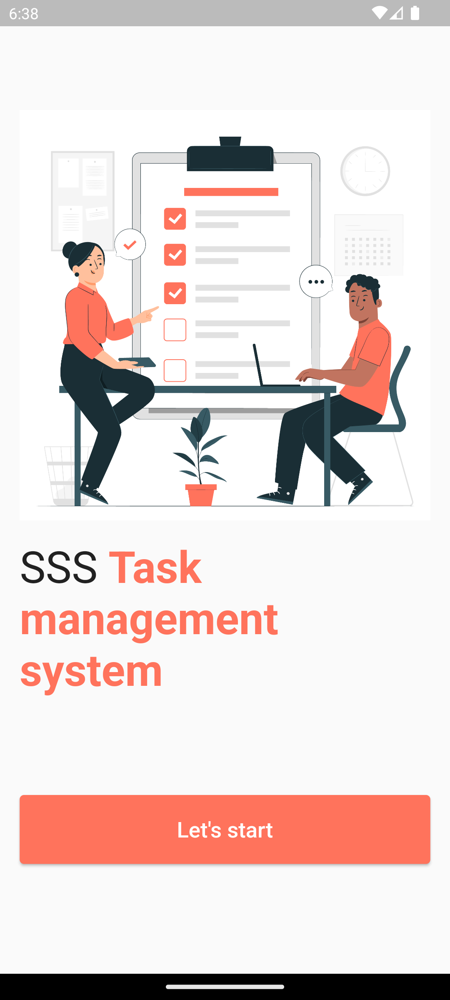
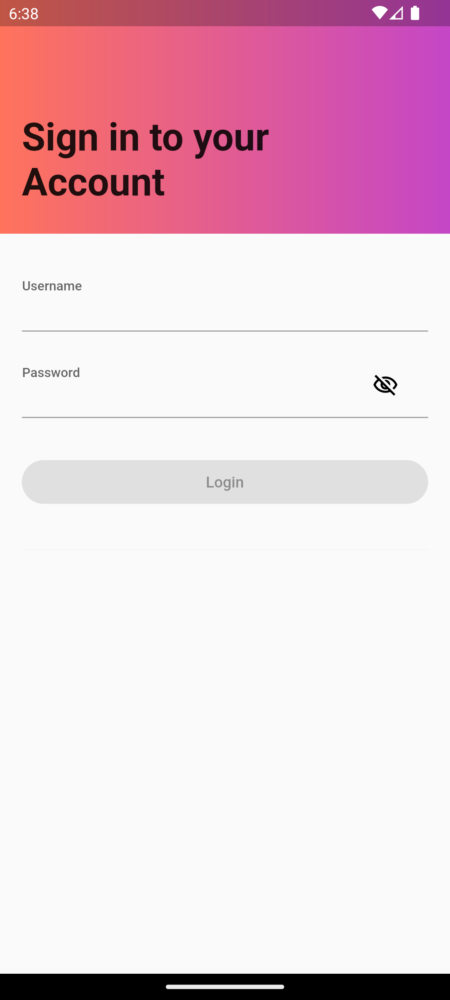
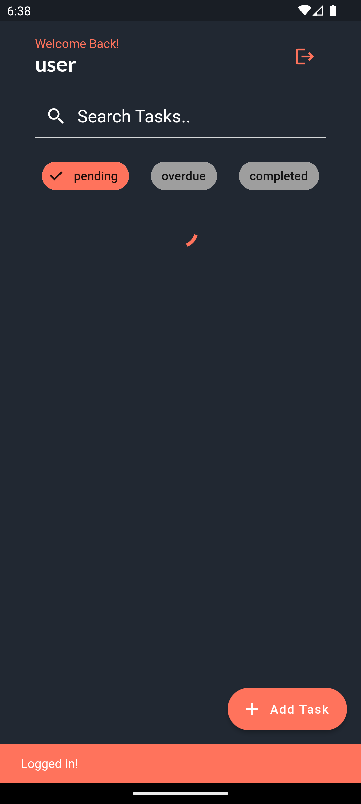
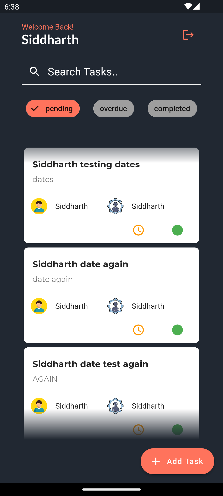
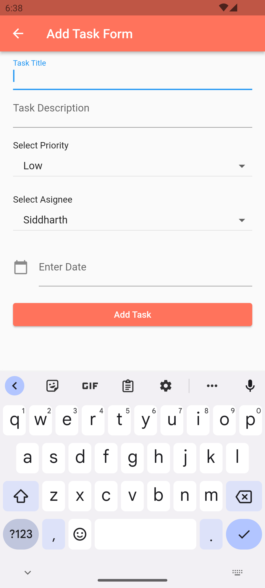

# Task-Management-Application
This is a prototype of a company-wide task management system built with flutter which uses the in-house built APIs for data integration and user authentication.
## Screenshots

